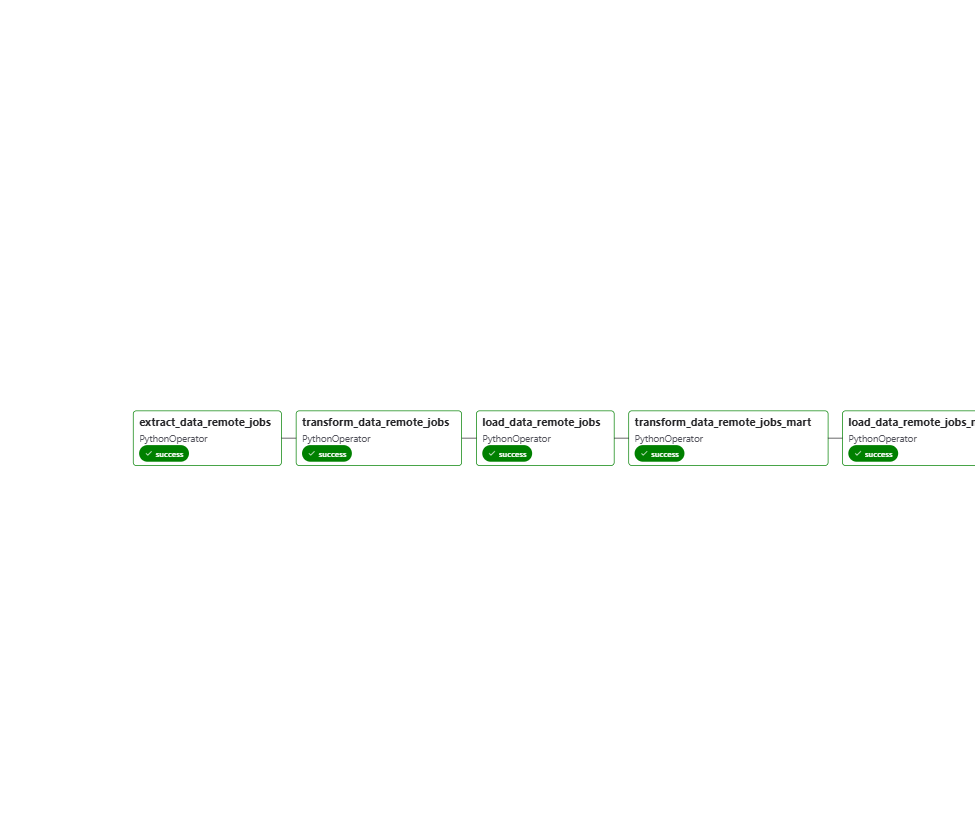

# Remote Job Analytics (Data Engineering Project) 
![Version][Version-Shield]

## Project Overview
Struggling to find a job will be the most problem for the job seeker, even it's intern or profesional job. From students to experienced worker, they faced the same problem. This project will provide job seeker to analyze the job market and find perfect job for them. 

## Project Architechture
This project was builded using data engineering concepts, including
* data pipeline to extract, transform, and load data into targeted form datasets
* data warehouse with three schemas, including stagging, mart, and analytics schema for analytics purpose
* dashboard analytics. In this project, i use Power BI to visualize the aggregate data

All of the process was builded by some tech stacks, including
* [![Docker][Docker-Logo]][Docker-Url]
* [![Apache Airflow][Apache-Airflow-Logo]][Apache-Airflow-Url]
* [![Python][Python-Logo]][Python-Url]
* [![Postgres][Postgres-Logo]][Postgres-Url]

## Data Process Flow


## DAG Flow


## Database Schema
Result from data pipeline will be store in the data warehouse with three different schema. All of them builded with medallion architecture (bronze, silver, and gold) to partitioning the purpose of each schema in data warehouse. There is description of each part of medallion architecture and implementation with the remote jobs data warehouse schema.

| Layer Name | Description | Implementation |
|-----------|-------------|-------------|
| 🥉 **Bronze** | Storing raw data in form SQL from transformed API data format | 💾 Stagging Schema |
| 🥈 **Silver** | Storing cleaned and selected data in form SQL with snowflake schema | 🛒 Mart Schema |
| 🥇 **Gold** | Storing aggregat data in form SQL which ready to use for analytics and machine learning purpose | 📊 Analytics Schema |

### 💾 Stagging Schema
Stagging schema consist tables that storing raw data that transformed from API form into SQL form. There is 4 (four) tables in stagging schema. Each table have spesific purpose, especially to transform the stagging data into mart schema. 


| Table Name | Description |
|-----------|-------------|
| **stg_api_metadata** | Consists metadata of extracted remote job API |
| **stg_job_industries** | Consists of industry type of job that exracted from API |
| **stg_job_types** | Consists type of job that extracted from API |
| **stg_jobs** | Consists Information of remote job that extracted from API |

### 🛒 Mart Schema
Mart schema consist tables that storing transformed and cleaned data from raw data in stagging schema. This schema is used to store daily data directly with an OLTP approach. This schema also applied snowflake schema to store detailed data from the main data more structured. 


| Table Name | Description |
|-----------|-------------|
| **bridge_job_industry** | - |
| **bridge_job_type** | - |
| **dim_company** | Consists detail company that offer the job |
| **dim_date** | Consists detail information time of job posted |
| **dim_industry** | Consists detail information of job industry |
| **dim_job_level** | Include level  |
| **dim_job_type** | Include detail type of job information |
| **dim_location** | Include detail location of job |
| **dim_salary** | Include detail information of job salary |
| **fact_remote_jobs** | Consists general information about remote job |

### 📊 Analytics Schema

🛠️ **This scheme is under developing**

## 📂 Project Structure

```text
project/
│
├── dag/
│   └── Apache Airflow DAGs for orchestrating the ETL workflow.
│
├── etl/
│   ├── extract/
│   │   └── Scripts for extracting data from external APIs.
│   │
│   ├── transform/
│   │   └── Data cleaning, preprocessing, and business transformations.
│   │
│   └── load/
│       └── Load processed data into the Data Warehouse schemas.
│
├── sql/
│   └── SQL scripts for schema creation, views, stored procedures, and queries.
│
│
└── dashboard/
    └── Power BI dashboard files and supporting assets.
```

---

## Directory Overview

| Directory | Description |
|-----------|-------------|
| **dag/** | Contains Apache Airflow DAG definitions used to orchestrate the entire data pipeline. |
| **etl/extract/** | Retrieves raw data from external APIs and prepares it for ingestion. |
| **etl/transform/** | Cleans, standardizes, and transforms raw data into targeted form datasets. |
| **etl/load/** | Loads transformed datasets into the appropriate Data Warehouse schema. |
| **sql/** | Contains SQL scripts for database creation, schema definitions, views, and ETL queries. |
| **dashboard/** | Includes Power BI reports (`.pbix`) and any supporting dashboard assets. |

### Directory Overview
Developed by Ibrahim Mumtaz Samadikun 

[![Postgres][Postgres-Logo]][Postgres-Url]

<!--Markdown Links & Images-->
<!--Url-->
[Docker-Url]:https://www.docker.com/
[Apache-Airflow-Url]:https://airflow.apache.org/
[Python-Url]:https://www.python.org/
[Postgres-Url]:https://www.postgresql.org/
[Version-Url]:https://github.com/ibrahimkuranglebih/Football-Data-Pipeline-12-Leagues?tab=readme-ov-file
[Linkedin-Url]:https://linkedin.com/in/ibrahimmumtaz/
<!--Logo-->
[Docker-Logo]:https://img.shields.io/badge/Docker-blue?logo=docker&logoColor=ffffff
[Apache-Airflow-Logo]:https://img.shields.io/badge/Apache_Airflow-017CEE?logo=apacheairflow&logoColor=ffffff
[Python-Logo]:https://img.shields.io/badge/Python-FBEF76?logo=python&logoColor=ffffff
[Postgres-Logo]:https://img.shields.io/badge/Postgres-4169E1?logo=postgresql&logoColor=ffffff
[Version-Shield]:https://img.shields.io/badge/Version-1.2-blue
[LinkedIn-Logo]: https://img.shields.io/badge/LinkedIn-0A66C2?logo=linkedin&logoColor=ffffff
